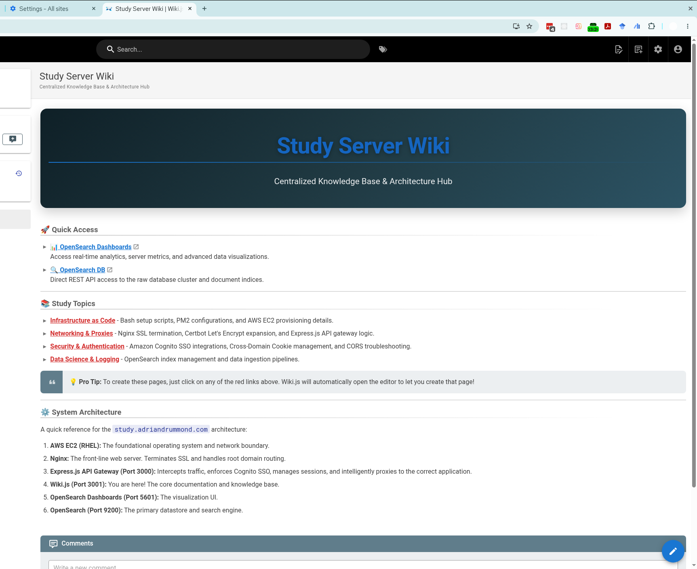

# Adrian Drummond's Study Server
**[study.adriandrummond.com](https://study.adriandrummond.com)**

## Overview
This repository contains the infrastructure as code and automation scripts powering my personal study server, built specifically to organize and accelerate my PhD coursework and research. 

Managing the immense volume of information encountered during a PhD program requires a robust, searchable, and highly organized system. This environment provides a centralized knowledge base capable of ingesting, analyzing, and structuring academic discussions, lecture notes, and research materials.

## Core Features
- **Centralized Knowledge Base (Wiki.js):** A premium, markdown-driven documentation hub for organizing class notes, literature reviews, and research documentation.
- **Automated Lecture Ingestion:** Features a serverless pipeline utilizing Google Apps Script and AWS (SES, S3, SQS) to automatically ingest, process, and publish Google Meet transcripts directly into the Wiki.
- **Advanced Search & Analytics (OpenSearch):** Leverages OpenSearch and OpenSearch Dashboards to provide lightning-fast, full-text search across all transcripts and notes, making it easy to cross-reference academic concepts.
- **Secure SSO Authentication:** Protected by a custom Express.js API Gateway integrated with Amazon Cognito for seamless Single Sign-On across all subdomains.

## Infrastructure & Architecture
The platform is fully automated and provisioned on AWS EC2 (RHEL), utilizing:
- **Nginx** for SSL termination and intelligent reverse proxying across multiple subdomains.
- **Express.js API Gateway** for stateful session management, cookie synchronization, and SSO route protection.
- **PostgreSQL** as the primary relational database backing the Wiki.
- **OpenSearch** for robust document indexing and visualizations.

*Note: All sensitive configuration data, passwords, and `.env` files have been intentionally excluded from this public repository.*
